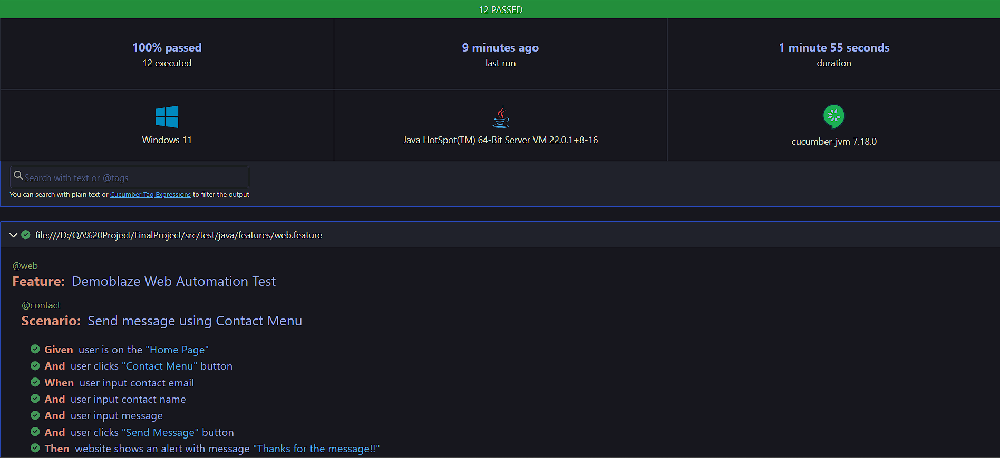

# API and Web Automation Tests

This project automates tests for the functionalities of [Dummy API](https://dummyapi.io/) and [Demo Blaze](https://www.demoblaze.com/index.html) using Java and Gradle.

## Features

- Easy-to-read tests: Scenarios are written in plain English using Gherkin syntax, improving test maintainability and collaboration. 
- Reusable steps: Common test actions are defined as reusable steps, promoting code reuse and reducing redundancy.
- Automatic Test Reporting: Generates comprehensive reports after test execution using Cucumber reporting plugins.
- Page Object Model (POM): Organizes test logic by separating page elements and interactions from the test steps, improving test maintainability and reducing duplication.

## Getting Started
This project uses Gradle for build automation. The Gradle Wrapper included in the project automatically downloads and runs the appropriate Gradle version required by the project. While you don't need to install Gradle to run the tests, you will need Java installed on your machine to execute the Java code within the tests. Refer to the official Java download page for installation instructions.

### Prerequisites

- Java 21 or later

### Installation

1. Clone the repository `git clone https://github.com/<Your Username>/final-project-qa-automation`
2. Navigate to project directory `cd final-project-qa-automation`
3. Run the test using Gradle Wrapper `./gradlew <Task Name>`

Available tasks:
1. `cucumberTest` : Run all tests
2. `apiTest` : Run only API test
3. `webTest` : Run only Web test

## Preview

Run the test according to the guide above.

Once the test have been executed, it will automatically generate a test report, which can be accessed in the `reports` directory.

